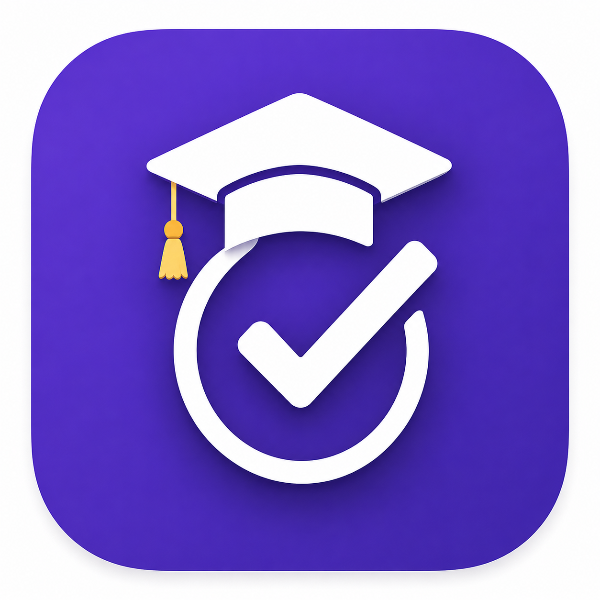
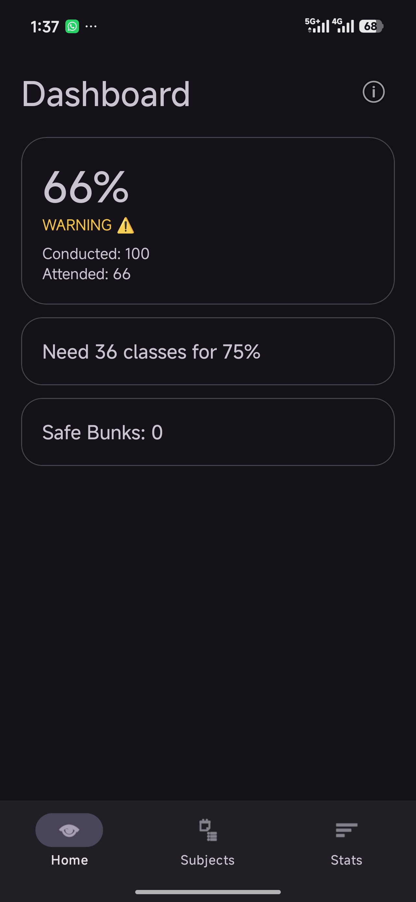
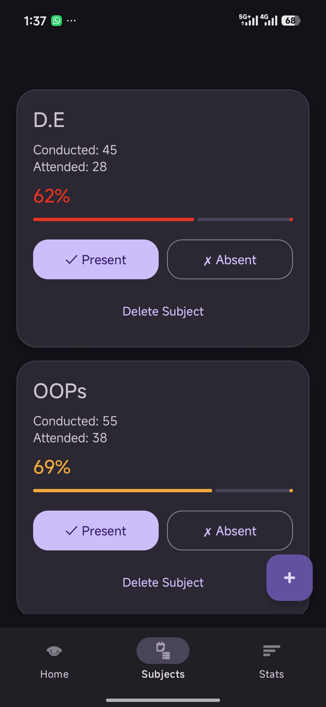
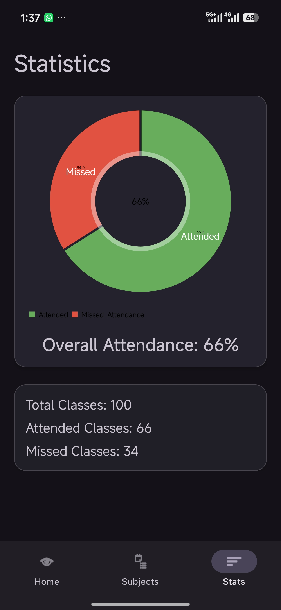
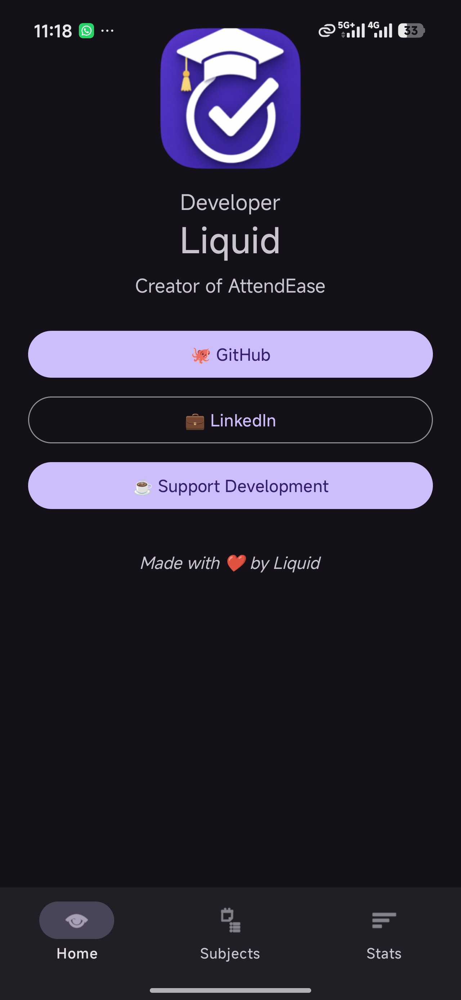

# 📚 AttendEase

  

  

---

## ✨ Features

- 📚 Subject Management
- 📊 Attendance Statistics
- 🎯 Attendance Prediction
- 🛌 Safe Bunk Calculator
- 📈 Progress Tracking
- 🎨 Material 3 Design
- 👨‍💻 Developer Page

---

## 📸 Screenshots

| Dashboard | Subjects |
|------------|------------|
|  |  |

| Statistics | About |
|------------|------------|
|  |  |

---

## 🛠 Tech Stack

- Kotlin
- Room Database
- LiveData
- ViewModel
- Navigation Component
- Material 3
- MPAndroidChart

---

## 👨‍💻 Developer

### Liquid

🐙 GitHub:
https://github.com/Liquid7z

💼 LinkedIn:
https://www.linkedin.com/in/iftiar-karim/

☕ Support Development:
https://buymeacoffee.com/liquidd

---

⭐ Star the repository if you like the project.
